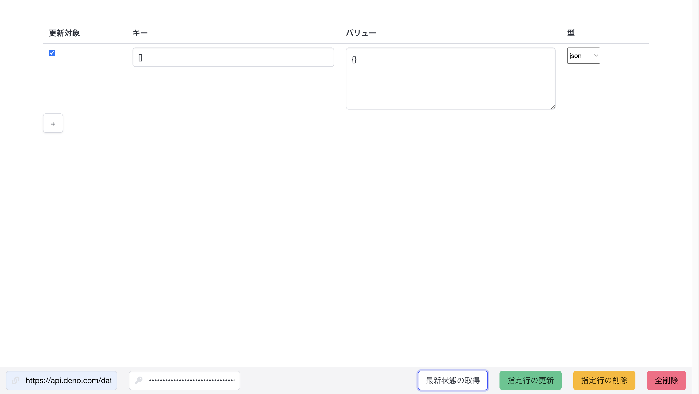

# deno-kv-manager

Deno KV用の管理画面プロジェクトです  
ローカルで起動して利用できるようになっています

localhost:8080を使用するため、通常のDenoプロジェクトとポートが衝突することはありません



## Installation

### 1. 前提環境の構築
以下のコマンドが使用できるようにしておいてください。
- `deno`

### 2. リポジトリのクローン
以下のコマンドを実行して下さい。
```sh
git clone git@github.com:Futaba-Kosuke/deno-kv-manager.git
cd deno-kv-manager
```

### 3. 起動
```sh
deno run -A --unstable server.ts
```

### Tutorial

1. 画面左下に、Deno KVのURLと、Deno Deployのアクセストークンを入力します

> アクセストークンの発行: https://dash.deno.com/account#access-tokens

2. 「最新状態の取得」を押下すると、Deno KVのデータが全取得されます

3. 「指定行の更新」を押下すると、チェックをつけた行の更新リクエストが発行されます

4. 「指定行の削除」を押下すると、チェックをつけた行の削除リクエストが発行されます

5. 「全削除」を押下すると、Deno KV内の全データが削除されます